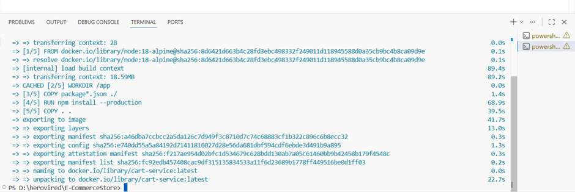
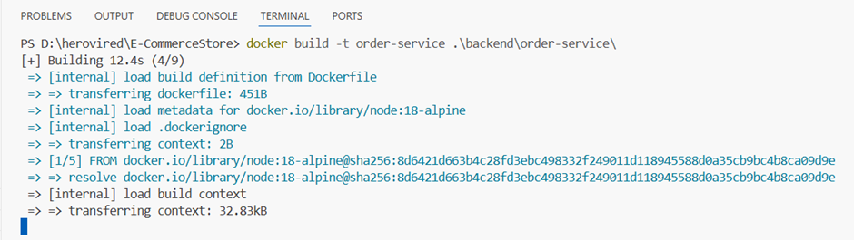
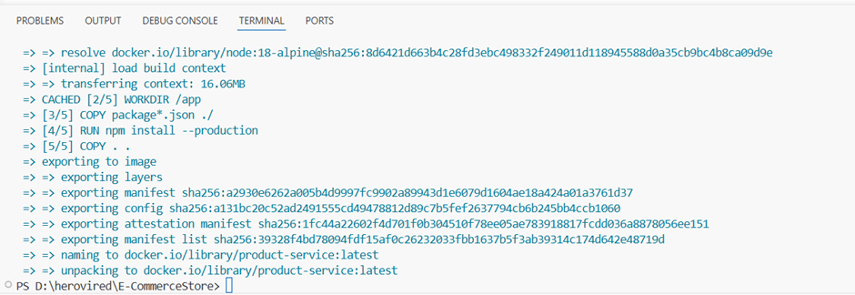
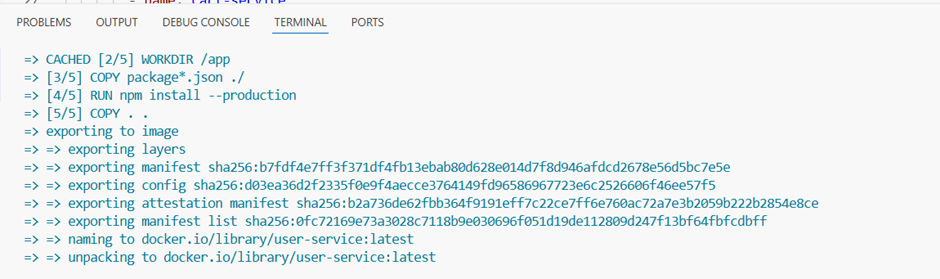

## Build the dockerfiles locally

 

 

 

 

 

  ### build and push all the docker images to dockerhub
 

 

### create the required terraform files setup as below link  

https://github.com/deeps19nija-collab/E-CommerceStore/tree/skilltest3_terrafoam/terrafoam/

 

 ### instance got created  

 

### Application is up and running   

 

 

 

 

